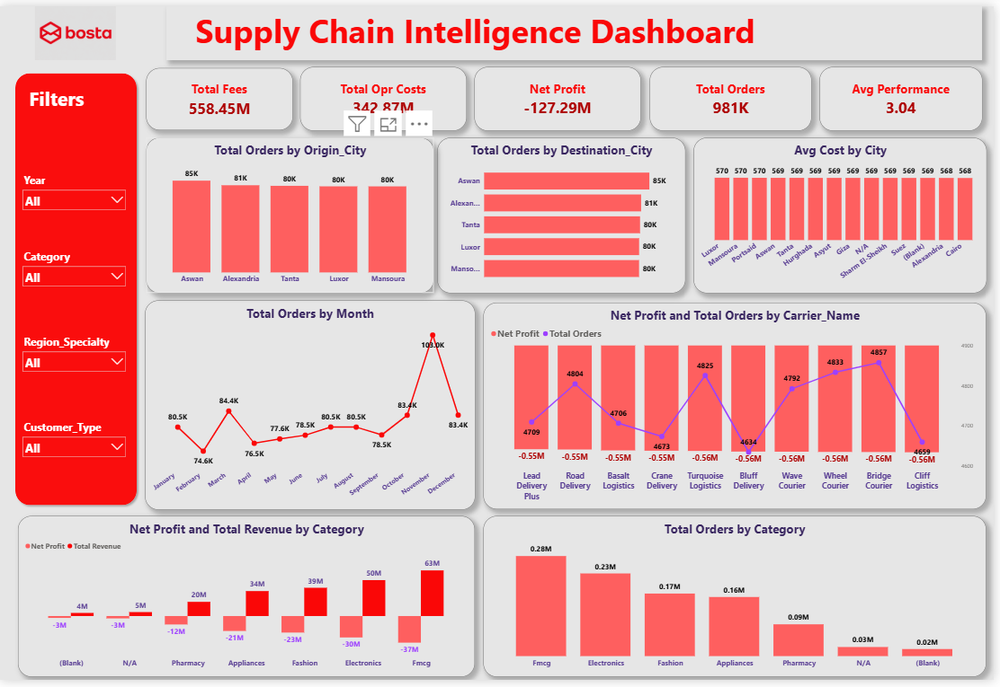

# Bosta Supply Chain Intelligence Dashboard | Power BI

An interactive **Power BI** dashboard analyzing nationwide shipment operations for an Egyptian parcel-delivery company (Bosta) — covering fees, operational costs, carrier performance, and regional/monthly trends across ~1 million orders.

📑 **[View Full Project Presentation (PowerPoint)](Bosta_Logistics_Dashboard_Presentation.pptx)**
📄 **[View Data Cleaning & Build Guide (Word)](Bosta_PowerBI_Project_Guide.docx)**

## 📌 Overview

This dashboard consolidates 12 months of shipment data (981,247 orders) into a single interactive view, enabling stakeholders to filter by **Year, Category, Region Specialty, and Customer Type**, and instantly see how fees, costs, and carrier performance respond.

## 🎯 Key KPIs

| Metric | Value |
|---|---|
| Total Orders | 981K |
| Total Fees | 558.45M EGP |
| Total Operational Costs | 342.87M EGP |
| Avg Carrier Performance Score | 3.04 |

## 🧹 Data Cleaning (Python)

The raw dataset (12 monthly CSV files + 3 dimension tables, ~981K rows) had significant quality issues before it was analysis-ready:

- Inconsistent city names (`cairo`, `CAIRO `, `Cairo`, `alex`...) → standardized to a single format
- Numeric columns stored with text units (`68.41 kg`, `EGP 628.3`) → cleaned and cast to proper decimals
- Incorrect negative values in operational cost (33,765 rows) → sign corrected
- ~19–20K unmatched foreign keys per table → mapped to an `Unknown` dimension member instead of being dropped
- Missing numeric values → imputed with median to preserve row count

Full methodology is documented in the included Word guide.

## 📊 Dashboard Visuals

- **Total Orders by Origin/Destination City** — bar charts of shipment volume by city
- **Avg Cost by City** — operational cost comparison across all 12 cities
- **Total Orders by Month** — seasonal trend across the year (clear peak in November)
- **Net Profit and Total Orders by Carrier** — combo chart comparing carrier volume vs. profitability
- **Net Profit and Total Revenue by Category** — waterfall-style breakdown by product category
- **Total Orders by Category** — FMCG and Electronics lead in volume

## 🔎 Key Insights

- **November** is a clear seasonal peak in order volume, standing out from every other month.
- **FMCG and Electronics** are the top categories in both order volume and revenue.
- Carrier performance (orders vs. profit) varies noticeably across carriers, useful for identifying top and underperforming partners.

> ⚠️ **Known issue to fix:** the current **Net Profit** measure shows a negative value despite Total Fees exceeding Total Operational Costs — this points to a DAX formula issue (likely a sign or filter-context error) that should be corrected before this is treated as a final, presentation-ready number.

## 🛠️ Tools & Techniques

- **Python (Pandas)** — cleaning and consolidating ~981K rows across 12 monthly files
- **Power Query** — data load and transformation into Power BI
- **Data Modeling** — Star Schema (Fact_Orders + Dim_Customers, Dim_Products, Dim_Carriers, Dim_Date)
- **DAX** — KPI measures, time intelligence, rate/margin calculations
- **Power BI** — interactive slicers, combo charts, KPI cards, dashboard UX design

## 📂 Files in this Repo

- `bosta-dashboard-overview.png` — full dashboard screenshot
- [`Bosta_Logistics_Dashboard_Presentation.pptx`](Bosta_Logistics_Dashboard_Presentation.pptx) — 📑 project presentation with real computed insights
- [`Bosta_PowerBI_Project_Guide.docx`](Bosta_PowerBI_Project_Guide.docx) — 📄 full data cleaning + Power BI build guide

## 👤 Author

**Sameh Sabry El-Hosary**
Data Analyst | Business Intelligence Analyst
[Portfolio](#) • [LinkedIn](#)
